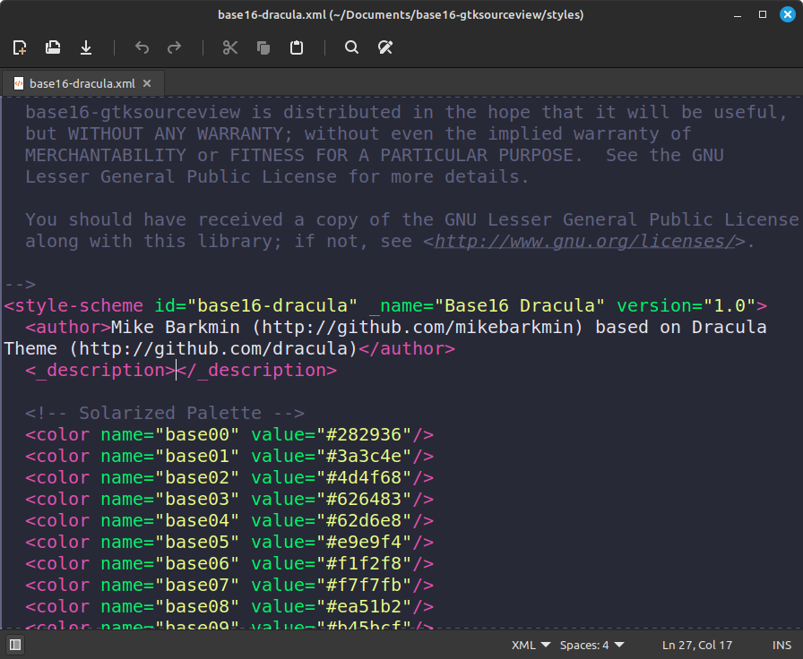

# base16-gtksourceview

[GTKSourceView](https://wiki.gnome.org/Projects/GtkSourceView) templates for [base16] color schemes to provide syntax highlighting in [GEdit](https://help.ubuntu.com/community/gedit), [Xed](https://github.com/linuxmint/xed), etc.



## Installation

1. [Download](https://github.com/RobLoach/base16-gtksourceview/archive/refs/heads/master.zip) the files

2. Extract the contents of the [`styles`](styles) directory into your gtksourceview styles directory:
    ```
    ~/.local/share/gtksourceview-3.0/styles
    ~/.local/share/gtksourceview-4/styles
    ```

3. You should end up with...
    ```
    ~/.local/share/gtksourceview-4/styles/base16-tomorrow.xml
    ```

4. Select the style in your text editor

## Contributing

See [`CONTRIBUTING.md`], which contains building and contribution
instructions.

[base16]: https://github.com/tinted-theming/home
[`CONTRIBUTING.md`]: CONTRIBUTING.md
